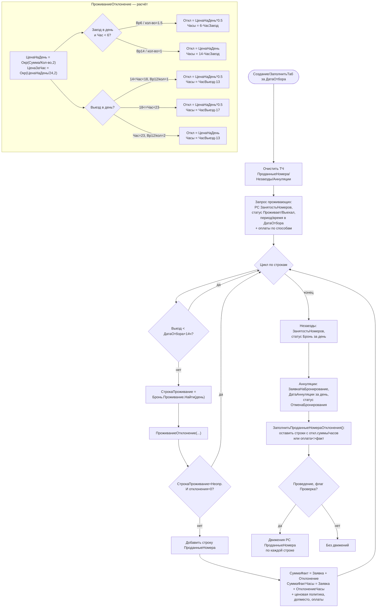

# Flowchart — Ежедневный аудит: сбор дня и расчёт отклонений

> `ЕжедневныйАудит.Форма.ФормаДокумента.ЗаполнитьТаб()` + `ПроживаниеОтклонение()` + `ОбработкаПроведения()`. Доверие 🟢.

```mermaid
flowchart TD
    Start([Создание/ЗаполнитьТаб за ДатаОтбора]) --> Clear[Очистить ТЧ<br/>ПроданныеНомера/Незаезды/Аннуляции]
    Clear --> Q1["Запрос проживающих:<br/>РС ЗанятостьНомеров,<br/>статус Проживает/Выехал,<br/>период/время в ДатаОтбора<br/>+ оплаты по способам"]
    Q1 --> Loop{Цикл по строкам}

    Loop --> Filter{Выезд < ДатаОтбора+14ч?}
    Filter -- да --> Loop
    Filter -- нет --> FindLive["СтрокаПроживание =<br/>Бронь.Проживание.Найти(день)"]
    FindLive --> Dev["ПроживаниеОтклонение(...)"]

    subgraph DevCalc["ПроживаниеОтклонение — расчёт"]
        D0["ЦенаНаДень = Окр(Сумма/Кол-во,2)<br/>ЦенаЗаЧас = Окр(ЦенаНаДень/24,2)"]
        D1{Заезд в день<br/>и Час < 6?}
        D1 -- "Вр6 / кол-во=1.5" --> D2["Откл = ЦенаНаДень*0.5<br/>Часы = 6-ЧасЗаезд"]
        D1 -- "Вр14 / кол-во=1" --> D3["Откл = ЦенаНаДень<br/>Часы = 14-ЧасЗаезд"]
        D4{Выезд в день?}
        D4 -- "14<Час<18, Вр12/кол=1" --> D5["Откл = ЦенаНаДень*0.5<br/>Часы = ЧасВыезд-13"]
        D4 -- "18<=Час<23" --> D6["Откл = ЦенаНаДень*0.5<br/>Часы = ЧасВыезд-17"]
        D4 -- "Час=23, Вр12/кол=2" --> D7["Откл = ЦенаНаДень<br/>Часы = ЧасВыезд-13"]
        D0 --> D1
        D0 --> D4
    end

    Dev --> Skip{СтрокаПроживание=Неопр.<br/>И отклонения=0?}
    Skip -- да --> Loop
    Skip -- нет --> AddRow[Добавить строку ПроданныеНомера]
    AddRow --> Calc["СуммаФакт = Заявка + Отклонение<br/>СуммаФактЧасы = Заявка + ОтклонениеЧасы<br/>+ ценовая политика, допместо, оплаты"]
    Calc --> Loop

    Loop -- конец --> Q2["Незаезды: ЗанятостьНомеров,<br/>статус Бронь за день"]
    Q2 --> Q3["Аннуляции: ЗаявкаНаБронирование,<br/>ДатаАннуляции за день,<br/>статус ОтменаБронирования"]
    Q3 --> Filter2["ЗаполнитьПроданныеНомераОтклонения():<br/>оставить строки с откл.суммы/часов<br/>или оплата<>факт"]
    Filter2 --> Post{Проведение, флаг Проверка?}
    Post -- да --> Mov["Движения РС ПроданныеНомера<br/>по каждой строке"]
    Post -- нет --> NoMov[Без движений]
```
