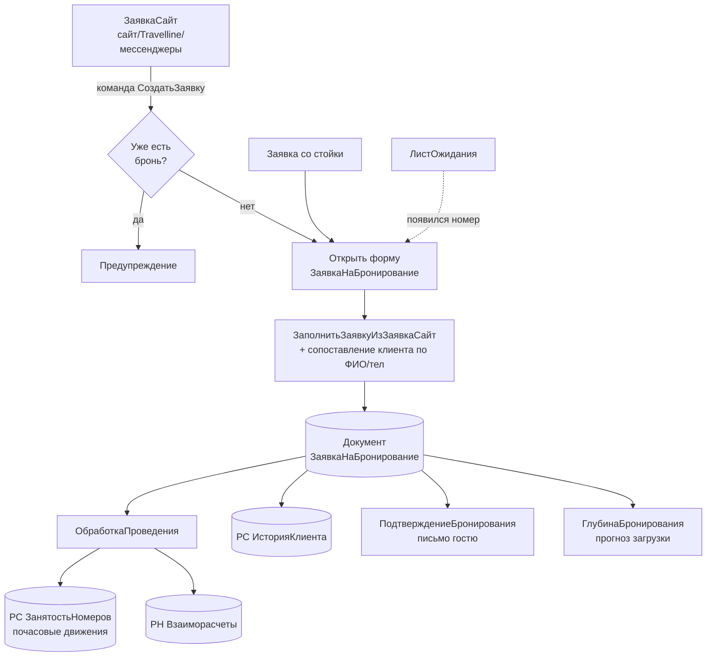
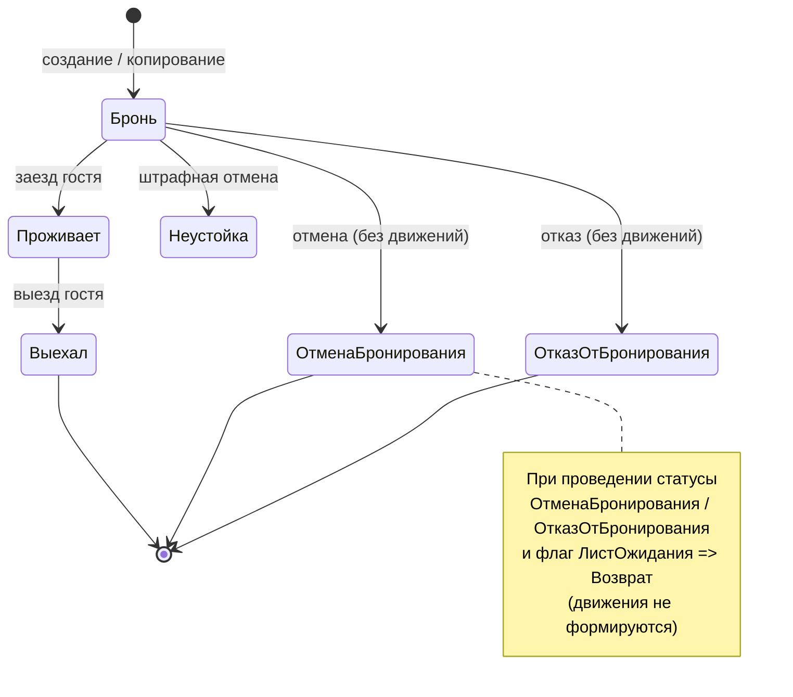

# Flowcharts — Модуль «Бронирование»

Диаграммы уровня модуля. Доверие: 🟢 из кода.

## Обзор: жизненный цикл брони и связи объектов

```mermaid
flowchart TD
    Site[ЗаявкаСайт<br/>сайт/Travelline/мессенджеры] -->|команда СоздатьЗаявку| Conv{Уже есть<br/>бронь?}
    Conv -- да --> Warn[Предупреждение]
    Conv -- нет --> Form[Открыть форму<br/>ЗаявкаНаБронирование]
    Stoyka[Заявка со стойки] --> Form
    WL[ЛистОжидания] -.->|появился номер| Form

    Form --> Fill[ЗаполнитьЗаявкуИзЗаявкаСайт<br/>+ сопоставление клиента по ФИО/тел]
    Fill --> Doc[(Документ<br/>ЗаявкаНаБронирование)]

    Doc --> Post[ОбработкаПроведения]
    Post --> Reg1[(РС ЗанятостьНомеров<br/>почасовые движения)]
    Post --> Reg2[(РН Взаиморасчеты)]
    Doc --> Hist[(РС ИсторияКлиента)]
    Doc --> Confirm[ПодтверждениеБронирования<br/>письмо гостю]

    Doc --> Depth[ГлубинаБронирования<br/>прогноз загрузки]
```

## Машина состояний `СтатусБрони`

```mermaid
stateDiagram-v2
    [*] --> Бронь: создание / копирование
    Бронь --> Проживает: заезд гостя
    Проживает --> Выехал: выезд гостя
    Бронь --> ОтменаБронирования: отмена (без движений)
    Бронь --> ОтказОтБронирования: отказ (без движений)
    Бронь --> Неустойка: штрафная отмена
    Выехал --> [*]
    ОтменаБронирования --> [*]
    ОтказОтБронирования --> [*]

    note right of ОтменаБронирования
        При проведении статусы
        ОтменаБронирования / ОтказОтБронирования
        и флаг ЛистОжидания => Возврат
        (движения не формируются)
    end note
```
